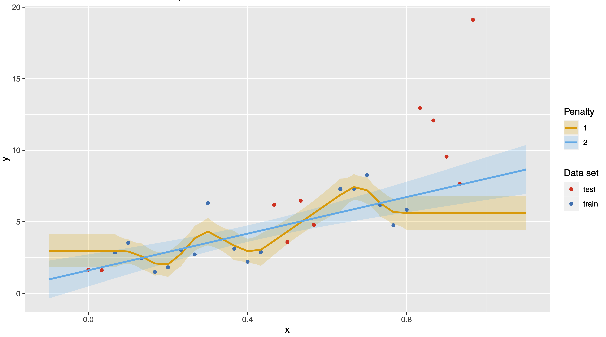

# BIOS-611 Project

This a project created by **Yixiang Qu** for BIOS 611 at UNC, Chapel Hill.

## Introduction

It is always an important topic to find suitable methods for spline in biostatistics. In order to compare different spline methods. I simulated univariate time series datasets with missing data and use different methods to interpolate the missing data. I use the `train` data as the input data and use `test` to evaluate the interpolation accuracy.



## Generate the report

First run the following command to create suitable docker image.

```bash
docker image build -t 611-hwk .
```


```bash
docker run -v $(pwd):/home/rstudio -e PASSWORD=yixiang -p 8787:8787 -t 611-hwk
```

And we can use the following command to clean the previous data.

```bash
make clean
```

And we can get the report using the following command.

```bash
make report.pdf
```
