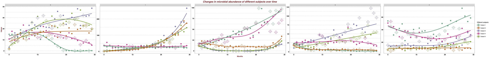
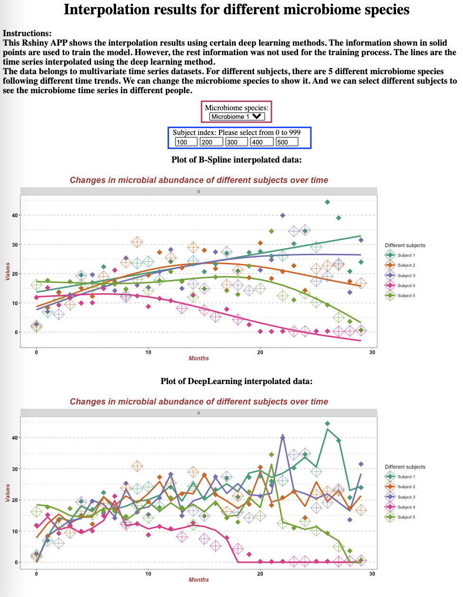

# BIOS-611 Project

This a project created by **Yixiang Qu** for BIOS 611 at UNC, Chapel Hill.

## Introduction

It is always an important topic to find suitable methods for spline in biostatistics. In order to compare different spline methods. I simulated multivariate time series datasets with missing data and use different methods to interpolate the missing data, one is from the deep learning method, and the other is the B-spline model. I use the `train` data as the input data and use `test` to evaluate the interpolation accuracy.



## Generate the plots

### Using docker to make life easier

First run the following command to create suitable docker image.

```
docker image build -t 611-hwk .
```

And we can run docker container using the following command.

```
docker run -v $(pwd):/home/rstudio -e PASSWORD=yixiang -p 8787:8787 -t 611-hwk
```

### Using Makefile to generate all the stuff

And we can use the following command to clean the previous data.

```
make clean
```

And we can get the plots of different interpolation methods using the following command.

```
make figure/B_spline.pdf
make figure/DL_spline.pdf
```

### Using Rshiny to see the results interactively

In order to run shiny, using the following command.

```
make shiny
```

You can use the botton circled in red to choose different microbiome species, and you can use the bottons circled in blue to choose different subjects.



## The final report

The final report is wrote using overleaf, and the source code can be seen in folder `Overleaf`.